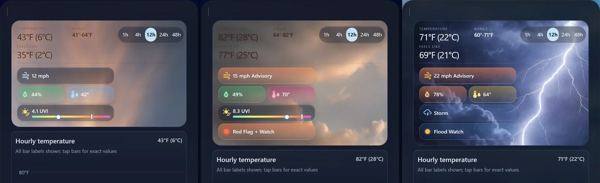

# Weather Risk Bridge

**US weather risk for the coordinates you care about** — NWS + SPC → Home Assistant app → Lovelace card.

Most weather cards show temperature. This one answers whether rain, storms, wind, hail, or tornado outlook matter **at your pin** over the next 1–48 hours.

## Why the app?

The **Weather Risk Bridge** Home Assistant app is the companion API. It fetches and caches official US sources, shapes a single snapshot for your lat/lon, and feeds the integration/card. On HAOS, install it from the App store first — that is the intended path. Docker on another host is supported when you want the API elsewhere.

## Quick start

1. Install the **Weather Risk Bridge** app (or run the companion service with Docker — see the README).
2. Install this repository in HACS as an **Integration**, then restart Home Assistant.
3. **Settings → Devices & Services → Add Integration → Weather Risk Bridge**.
4. Service URL: leave the auto-filled `http://172.30.x.x:8099` on Home Assistant OS (or use `http://HOME_ASSISTANT_HOST_IP:8099` if blank). For Docker on a separate machine: `http://OTHER_HOST_LAN_IP:8099`.
5. Enter a **label** and your **latitude** / **longitude** (decimal degrees; US west longitudes are negative).
6. Add the card with `location:` matching your label slug (for example `home`).

Full setup, screenshots, and separate-host Docker instructions are in the repository [README](https://github.com/pHarmG/weather-risk-bridge/blob/main/README.md).
